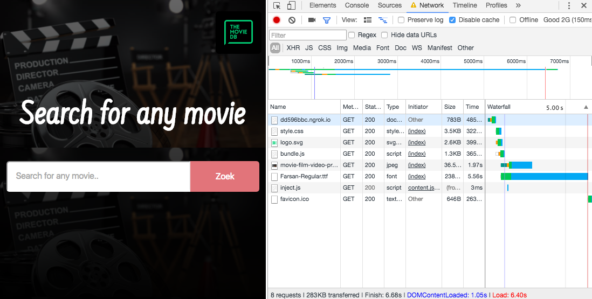
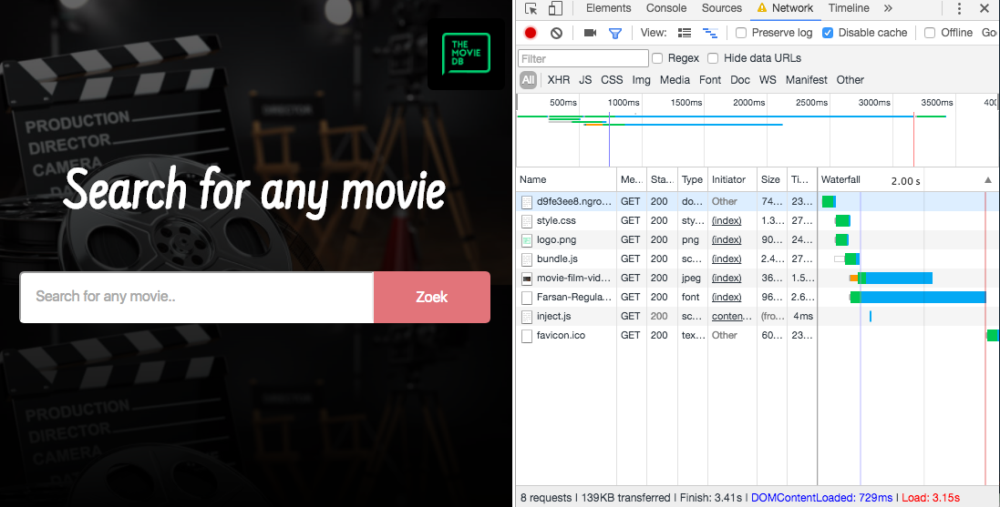
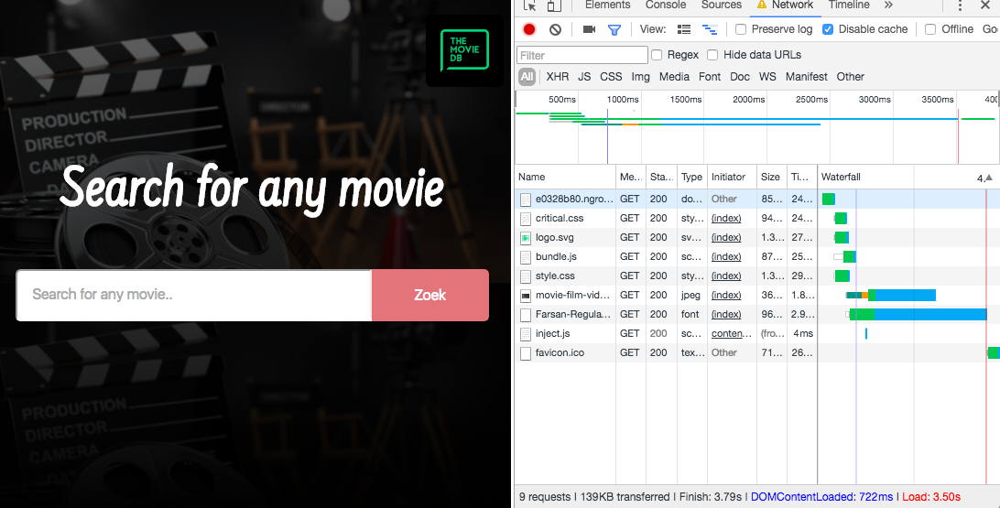
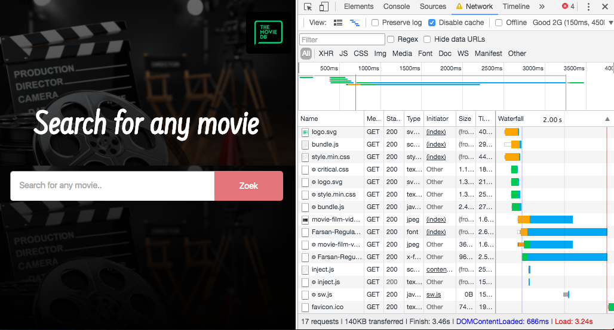
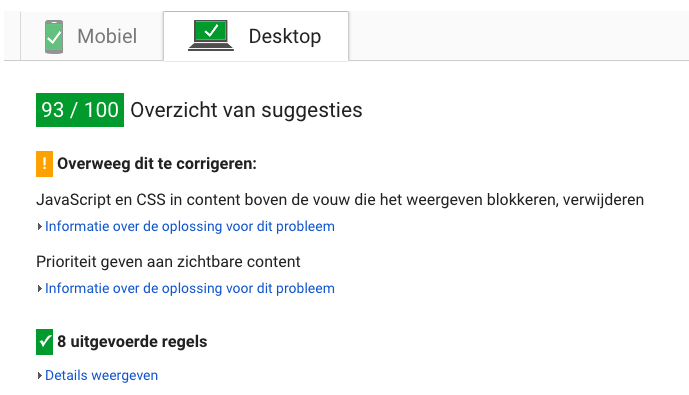
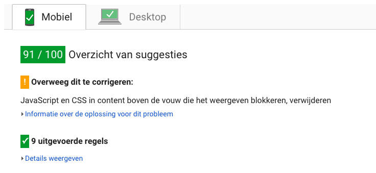

# Movie app
Assignment to make a server side app with certain performance techniques and a service worker. I used the <a href="https://www.themoviedb.org/">"https://www.themoviedb.org/"</a> API to fetch the movies.

  
Search for any movie  
<br>
  
Get your results  
<br>
  
Get more information  
  
  
## Intro
I created a new API because I didn't like the fact that Funda will pull their API eventually. This way I can look back at my project in a few months and see what I could've done better and maybe try to improve it.

I tried to relearn Node.js in these 2 weeks so it took me a lot of time to get things up and running while learning about new tooling like <a href="browserify.org">Browserify</a> and <a href="http://requirejs.org/docs/commonjs.html">Common.js</a>. I also implemented a service worker so my site shows a couple of files/pages without an internet connection.
  


## Build
To run the application:
```bash
git clone
```
  
The current `<a href="https://www.npmjs.com/package/dotenv">.env</a>` is hidden from GitHub. Make sure you add a `<a href="https://www.npmjs.com/package/dotenv">.env</a>` file with the API key.   Example:    
`API_KEY=2WE8979wWPuweoiwuer`
  
To use the app you need to run the following commands:  
```bash
npm install
```
To install the Node dependencies.
```bash
npm start
```
To start the server on port `9000`  
```bash
npm run expose
``` 
To run <a href="https://ngrok.com/">ngrok</a> to expose the application to the web (optional)
  

  
## Tooling
In order to use 'require' client side I used <a href="http://browserify.org/">Browserify</a> to make 1 bundle.js which combines all the Javascript files.

For example, in a random.js file I used:  
`const random = 'wow this is random';`  
`module.exports = random;`  

And in the app.js file I required all exported files:

```js  
const random = require('./random');  
const navigator = require('./navigator');
const fontface = require('./fontface'); 
```
  
```js 
console.log(random);
``` 
Here I can use the const I made in the random.js file.
  
To complete this I ran `npm run build` which compiled the app.js (with all the required files) file into the bundle.js.
  

  
## Performance
I implemented the following techniques to improve the performance of the application. These were all tested on a very slow connection (2G) so that I could measure the speed in a more precise way:
  

#### Normal
*This is the speed without increasing the performance.*
  

#### Gzip
*Here I implemented Gzip. Gzip makes sure that the files becomes 'zipped' like you would do on your computer, but instead of the computer these zip's go to the browser. As you can see it already went from around ~6000ms to ~3300ms. A huge improvement.*  
  

#### SVG + compression
*Now here it seems like I slowed down the application by using an svg. This is true. The image for the logo that I was using was a very low quality/ugly PNG file. I created a fallback for if the browser doesn't support SVG files:*
  
``  
  
*To compress the SVG further I used <a href="compression.io">compression.io</a>*  
  

#### Fontfaceobserver
*Fontfaceobserver makes sure you see a fallback font until the custom font is loaded. This way we don't have to see empty font-less spots while loading the website. You can already see we cut it down to ~3300ms again.*  
  

##### Critical css
*Critical css loads the css that fills your viewport first so it can load the latter while you're still looking at the zero-state. This way the perceived performance is increased a lot even though the numbers don't necessarily tell you.*  
  

#### Minify
*Since Browserify already bundles all the Javascript files I only minified CSS. The speed went a bit up from the previous improvement.*  
  

  
#### PageSpeed rating
*The rating didn't actually change from start to end because the application wasn't that slow to start with. However we did see it improve in speed and usability because I tested it on a 2G network.*  
  


## Service worker
The service worker I implemented will make sure that the css/fonts/images get cached into the browser. It also remembers the path the users has taken before so it can render this path even without an internet connection. If the user is offline and he tries to visit a page that he didn't visit before, offline.html gets rendered and the user gets to see this:
  

  
If you go to <a href="http://caniuse.com/#search=servi">caniuse.com</a> you can see that the service worker isn't widely supported yet. To make sure this isn't a problem I created a fallback that checks if the service worker is supported:
  
```js
if ('serviceWorker' in navigator) {
	navigator.serviceWorker.register('./sw.js', { scope: './' }).then((registration) => {
		console.log('SW found');
	}).catch((err) => {
		console.log('SW not found', err);
	});
}
```
  
When it isn't supported the app will just run without the service worker.

## TODO
-  [ ] Search suggestions
-  [ ] Filtering on genre's
-  [ ] Sorting on ratings
-  [ ] Babelify it
-  [ ] Get a 100/100 score on <a href="https://developers.google.com/speed/pagespeed/insights/?hl=nl">PageSpeed</a>

## Sources
<a href="https://www.themoviedb.org/">https://www.themoviedb.org/</a>  
<a href="http://caniuse.com/#search=servi">caniuse.com</a>
<a href="https://fontfaceobserver.com/">https://fontfaceobserver.com/</a>  
<a href="http://browserify.org/">http://browserify.org/</a>  
<a href="https://criticalcss.com/">https://criticalcss.com/</a>  
<a href="https://www.npmjs.com/package/compression">https://www.npmjs.com/package/compression</a>  
<a href="https://www.npmjs.com/package/dotenv">"https://www.npmjs.com/package/dotenv"</a>  
<a href="https://developers.google.com/speed/pagespeed/insights/?hl=nl">https://developers.google.com/speed/pagespeed/insights/?hl=nl</a>

## License
MIT License

Copyright &copy; 2017 Luuk Hafkamp
