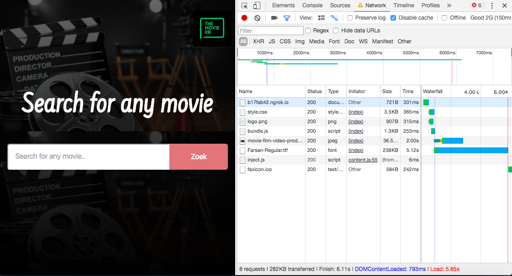
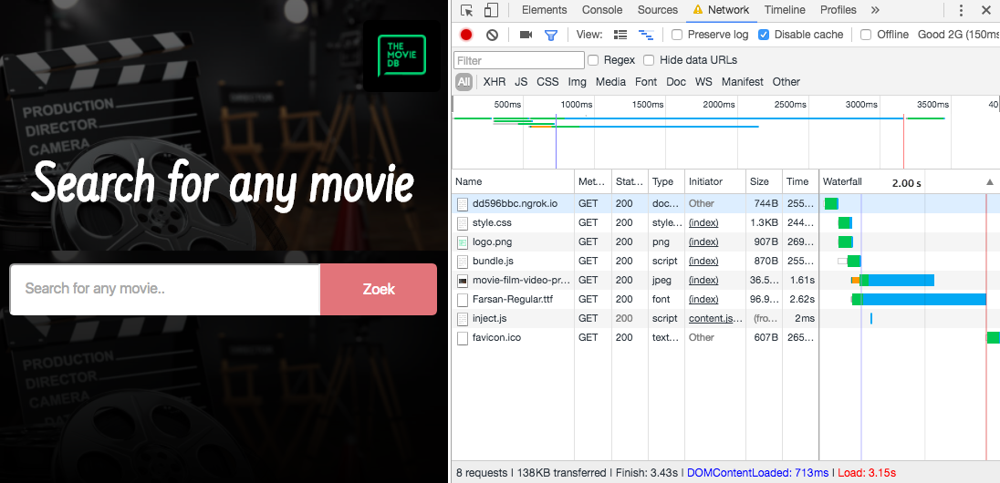

# Movie app
Assignment to make a server side app with certain performance techniques and a service worker. I used the <a href="https://www.themoviedb.org/">"https://www.themoviedb.org/"</a> API to fetch the movies.

## Intro
I created a new API because I didn't like the fact that Funda will pull their API eventually. This way I can look back at my project in a few months and see what I could've done better and maybe try to improve it.

I tried to relearn Node.js in these 2 weeks so it took me a lot of time to get things up and running while learning about new tooling like <a href="browserify.org">Browserify</a> and <a href="http://requirejs.org/docs/commonjs.html">Common.js</a>. I also implemented a service worker so my site shows a couple of files/pages without an internet connection.

## Build

The current `.env` is hidden from GitHub. Make sure you add an `.env` file with the following API key:  
`API_KEY={yourAPIKEYhere}`.

To use the app you need to run the following commands:  
- `npm install` to install the Node dependencies  
- `npm start` to start the server on port `9000`  
- `npm run expose` to run <a href="https://ngrok.com/">ngrok</a> to expose the application to the web (optional)
  

## Tooling
In order to use 'require' client side I used Browserify to make 1 bundle.js which combines all the Javascript files.

For example, in a random.js file I used:
`const random = 'wow this is random';`  
`module.exports = random;`  

And in the app.js file I required all exported files:
`const random = require('./random');`  
`const navigator = require('./navigator');`  
`const fontface = require('./fontface');`  
  
`console.log(random);` (here I can use the const I made in the random.js file)  
  
To complete this I ran `npm run build` which compiled the app.js (with all the required files) file into the bundle.js.

## Performance
I implemented the following techniques to improve the performance of the application. These were all tested on a very slow connection (2G) so that I could measure the speed in a more precise way:
  

*This is the speed without increasing the performance.*
  

*Here I implemented Gzip. Gzip makes sure that the files becomes 'zipped' like you would do on your computer, but instead of the computer these zip's go to the browser. As you can see it already went from around ~6000ms to ~3300ms. A huge improvement.*  
  

*Now here it seems like I slowed down the application by using an svg. This is true. The image for the logo that I was using was a very low quality/ugly PNG file. I created a fallback for if the browser doesn't support SVG files:*
  
``  
  
*To compress the SVG further I used <a href="compression.io">compression.io</a>*  
  

*Fontfaceobserver makes sure you see a fallback font until the custom font is loaded. This way we don't have to see empty font-less spots while loading the website. You can already see we cut it down to ~3300ms again.*  
  

*Critical css loads the css that fills your viewport first so it can load the latter while you're still looking at the zero-state. This way the perceived performance is increased a lot even though the numbers don't necessarily tell you.*  
  

*Since Browserify already bundles all the Javascript files I only minified CSS. The speed went a bit up from the previous improvement.*  
  

  
*The rating didn't actually change from start to end because the application wasn't that slow to start with. However we did see it improve in speed and usability because I tested it on a 2G network.*  

## Service worker

## Sources
<a href="https://www.themoviedb.org/">"https://www.themoviedb.org/"</a>  
<a href="https://fontfaceobserver.com/">https://fontfaceobserver.com/</a>  
<a href="http://browserify.org/">http://browserify.org/</a>  
<a href="https://criticalcss.com/">https://criticalcss.com/</a>  
<a href="https://www.npmjs.com/package/compression">https://www.npmjs.com/package/compression</a>  
<a href="https://www.npmjs.com/package/dotenv">"https://www.npmjs.com/package/dotenv"</a>